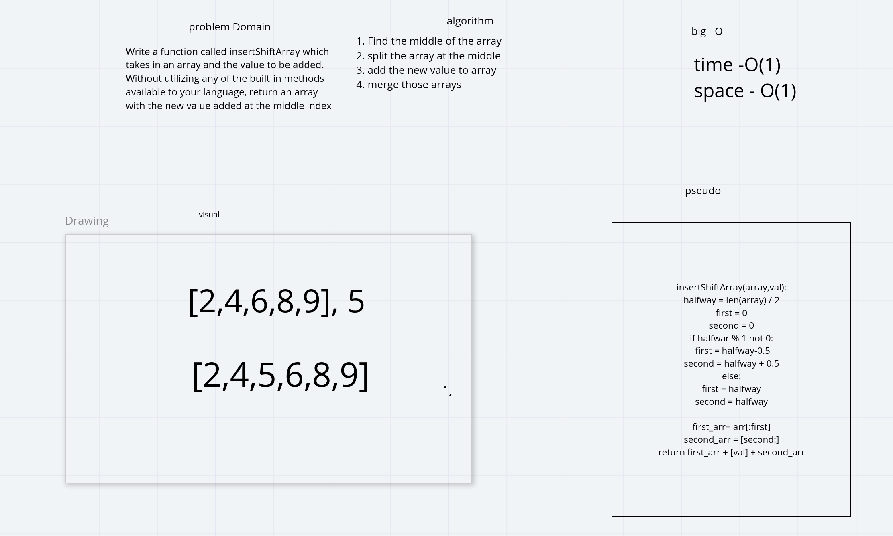

# Shift a value into an Array
Lee-Roy King and Richard Whitehead

## Challenge

Write a function called insertShiftArray which takes in an array and the value to be added. Without utilizing any of the built-in methods available to your language, return an array with the new value added at the middle index.

## Approach & Efficiency
Find the middle index for the list, then split the array on that index and rejoin the list with the new value in the middle. return that new list

## Solution

