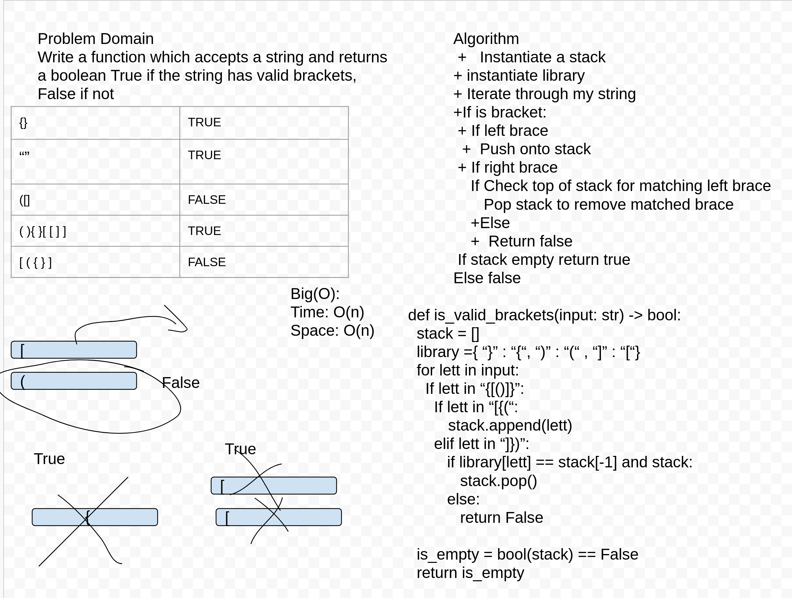

# Multi Bracket Validation

## Multi-Bracket Validation 
*Author: Lee-Roy King*

---

### Problem Domain
Your function should take a string as its only argument, and should return a boolean representing whether or not the brackets in the string are balanced. There are 3 types of brackets:

    Round Brackets : ()
    Square Brackets : []
    Curly Brackets : {}

---

### Inputs and Expected Outputs

| Input | Output |
| :----- | :-----|
| {} |	TRUE |
| {}(){} |	TRUE |
| ()[[Extra Characters]] |	TRUE |
| (){}[[]] |	TRUE |
| {}{Code}[Fellows](())  |	TRUE |
| [({}] |	FALSE |
| (]( |	FALSE |
| {(}) |	FALSE |

---

### Big O

| Time | Space |
| :----------- | :----------- |
| O(n) | O(n) |

----
### Visual

---

### Change Log
1.0 Implemented requested features
---

